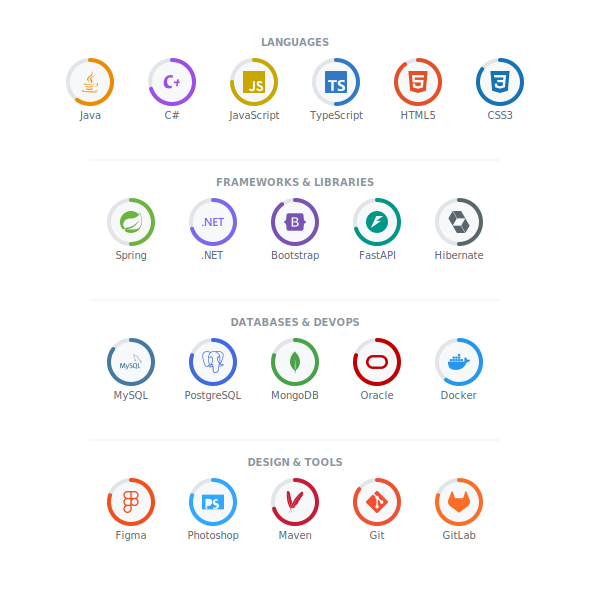

 

---

## 👨‍💻 About Me

Hi, I'm **Moein Alvandi**, a passionate and energetic programmer specializing in **Java** and **C#**. I love solving problems with creative solutions and have extensive experience in various programming languages and web development. I'm always eager to learn, stay updated with the latest technologies, and contribute to the software industry. Let's build something amazing together!

- 🔭 Specializing in **Java** and **C#** backend development
- 🌱 Always learning and staying updated with the latest technologies
- 💡 Love solving problems with creative solutions
- 🤝 Open to collaboration and contributing to the software industry
- 📫 Reach me at **mr.programmer1398@gmail.com**

---

## 💻 Tech Stack & Skills

---

## 📊 GitHub Stats

---

*"First, solve the problem. Then, write the code."* — John Johnson

